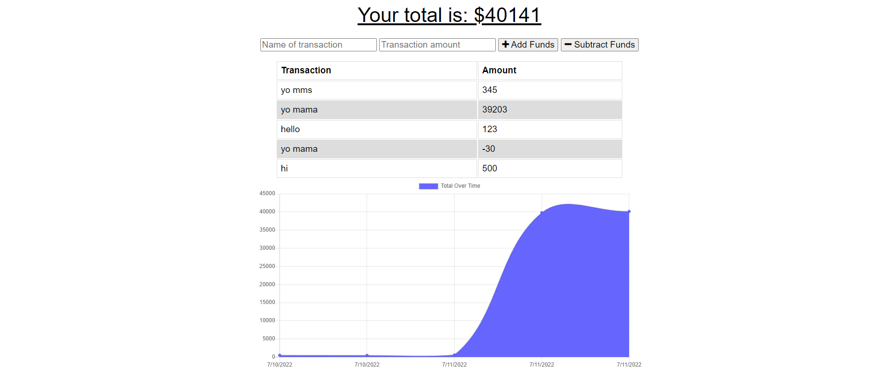

# Budget Tracker


  
## Description

A budget tracker application that allows offline access and functionality. The user can add expenses and deposits to their budget with or without an internet connection. When user enters transactions offline, the total should be updated when they're brought back online.

[budget tracker](https://budget-tracker-realnifty.herokuapp.com/)

## Table of Contents

- [Installation](#installation)
- [Usage](#usage)
- [License](#license)
- [Contributing](#contributing)
- [Tests](#tests)
- [Questions](#questions)

## Installation

Clone the code from this repository to your local machine. Node.js is required to run this application.

```
- npm i for required dependencies
- npm start to initalize server
```

## Usage

- Load the application by navigating to the [deployment](https://budget-tracker-realnifty.herokuapp.com/) on heroku.
- Once there, open the dev tools and set throttling to offline.
- User should now be able to continue in the application without a connection.



## License
    
Licensed under the [MIT License](https://spdx.org/licenses/MIT.html)

## Contributing

No contributions will be accepted at this time.

## Tests

No tests planned for this application at this time.

## Questions

Have questions? Reach me at the following sources!

* GitHub: [realnifty](https://github.com/realnifty)
* E-mail: lovecore@pm.me